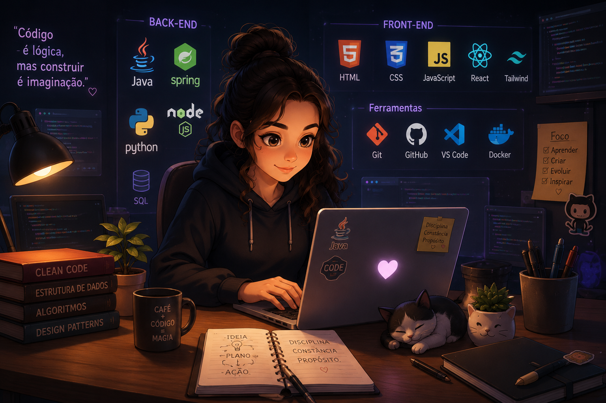

# 👋 Olá, eu sou a Raquel Barcheta!

------------------------------------------------------------------------

## 🧑 Sobre mim

Estou em transição de carreira para a área de tecnologia, com foco
em **Desenvolvimento Full Stack** por meio de um bootcamp da Generation Brasil, 
onde venho aprendendo e praticando tecnologias voltadas para o desenvolvimento 
**Backend** e **Frontend**.

------------------------------------------------------------------------

## 🚀 Tecnologias e Aprendizados

- 💻 Backend: Java, Spring Boot (em aprendizado)
- 🎨 Frontend: HTML, CSS, JavaScript
- 🗄️ Banco de Dados: MySQL
- 🔧 Ferramentas: Git, GitHub

------------------------------------------------------------------------

## 🌎 Onde me encontrar

📧 **Email profissional:** raquelbarcheta@gmail.com

------------------------------------------------------------------------

⭐ *Sempre aberta a colaborações, novas ideias e desafios!*
